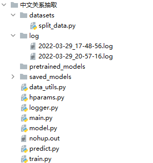
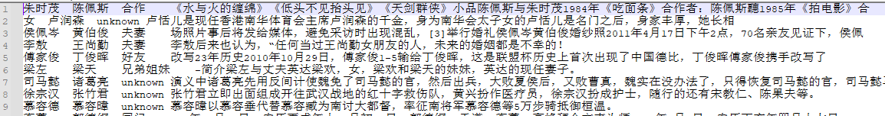
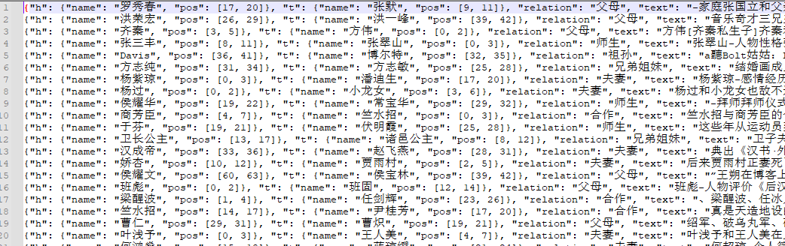

# 基于R-BERT的中文任务关系抽取任务

### R-BERT模型：


详情见另一个GitHub的仓库：https://github.com/zhanghaok/Relation-Extraction-Baseline

### 代码详解：



代码目录见上图。

#### `dataset/split_data.py`：数据集的处理；

原始数据集：



**关键代码1：将原始文本中的数据转换成json格式**

```python
def convert_data(line):
    """
    将原始文本中的数据转换成json格式
    """
    head_name , tail_name , relation, text = re.split(r'\t',line)
    match_obj1 = re.search(head_name,text)
    match_obj2 = re.search(tail_name,text)
    if match_obj1 and match_obj2: #姑且使用第一个匹配的实体的位置
        head_pos = match_obj1.span()
        tail_pos = match_obj2.span()
        item = {
            'h': {
                    'name':head_name,
                    'pos':head_pos
                },
            't':{
                'name':tail_name,
                'pos':tail_pos
            },
            'relation':relation,
            'text':text
        }
        return item
    else:
        return None
```

这部分代码将原始数据集转换为json格式的形式，并标注两个实体的位置。

转换后的数据集格式为：



**关键代码2：将原始数据切分为训练集和验证集**

```python
def split_data(file):
    """
    将all_data文件切分成训练集和验证集
    """
    file_dir = os.path.dirname(file)
    train_file = os.path.join(file_dir,'train.jsonl')
    val_file = os.path.join(file_dir,'val.jsonl')
    with open(file,'r',encoding='utf-8') as f_in:
        lines = f_in.readlines()
    lines =  [line.strip() for line in lines]
    random.shuffle(lines)
    lines_len = len(lines)
    train_lines = lines[:lines_len * 7 // 10]
    val_lines = lines[lines_len * 7 // 10:]
    save_data(train_lines,train_file)
    save_data(val_lines,val_file)
```

#### `hparam.py` :参数设置,包括模型参数与训练相关的参数；

#### `logger.py`:日志管理器，输出一些日志信息，输出的日志存放在log文件夹；

#### `data_util.py`：读取数据并进行数据预处理（为送入模型做准备）；

**关键代码1：分词器类。最核心的功能是在一个句子中的两个实体的边界插入特殊的字符，其次在句首插入[CLS]句尾插入[SEP]。**

示例：

`原始text`：-家庭张国立和父亲张默是张默和前妻罗秀春的儿子，据了解，张国立与罗女士相识于少年时代，长

`返回值`：['[CLS]', '-', '家', '庭', '张', '国', '立', '和', '父', '亲', '[unused2]', '张', '默', '[unused4]', '是', '张', '默', '和', '前', '妻', '[unused1]', '罗', '秀', '春', '[unused3]', '的', '儿', '子', '，', '据', '了', '解', '，', '张', '国', '立', '与', '罗', '女', '士', '相', '识', '于', '少',,,'[SEP]']


```
class MyTokenizer(object):
    def __init__(self,pretrained_model_path,mask_entity=False):
        self.pretrained_model_path = pretrained_model_path #'/home/zhk/pretrained-model/bert-base-chinese'
        self.bert_tokenizer = BertTokenizer.from_pretrained(self.pretrained_model_path)
        self.mask_entity = mask_entity

    def tokenize(self,item):
        sentence = item['text']#'-家庭张国立和父亲张默是张默和前妻罗秀春的儿子，据了解，张国立与罗女士相识于少年时代，长'
        pos_head = item['h']['pos']#[17, 20]头实体
        pos_tail = item['t']['pos']#[9, 11]尾巴实体
        if pos_head[0] > pos_tail[0]:
            pos_min = pos_tail#[9, 11]
            pos_max = pos_head#[17, 20]
            rev = True
        else:
            pos_min = pos_head
            pos_max = pos_tail
            rev = False

        sent0 = self.bert_tokenizer.tokenize(sentence[:pos_min[0]])#['-', '家', '庭', '张', '国', '立', '和', '父', '亲']
        ent0 = self.bert_tokenizer.tokenize(sentence[pos_min[0]:pos_min[1]])#['张', '默']
        sent1 = self.bert_tokenizer.tokenize(sentence[pos_min[1]:pos_max[0]])#['是', '张', '默', '和', '前', '妻']
        ent1 = self.bert_tokenizer.tokenize(sentence[pos_max[0]:pos_max[1]])#['罗', '秀', '春']
        sent2 = self.bert_tokenizer.tokenize(sentence[pos_max[1]:])#['的', '儿', '子', '，', '据', '了', '解', '，', '张', '国', '立', '与', '罗', '女', '士', '相', '识', '于', '少', '年', '时', '代', '，', '长']

        if rev:
            if self.mask_entity:
                ent0 = ['[unused6]']
                ent1 = ['[unused5]']
            pos_tail = [len(sent0), len(sent0) + len(ent0)]#[9, 11]
            pos_head =[
                len(sent0) + len(ent0) + len(sent1),
                len(sent0) + len(ent0) + len(sent1) + len(ent1)
            ]#[17, 20]
        else:
            if self.mask_entity:
                ent0 = ['[unused5]']
                ent1 = ['[unused6]']
            pos_head = [len(sent0), len(sent0) + len(ent0)]
            pos_tail = [
                len(sent0) + len(ent0) + len(sent1),
                len(sent0) + len(ent0) + len(sent1) + len(ent1)
            ]
        #['-', '家', '庭', '张', '国', '立', '和', '父', '亲', '张', '默', '是', '张', '默', '和', '前', '妻', '罗', '秀', '春', '的', '儿', '子', '，', '据', '了', '解', '，', '张', '国', '立', '与', '罗', '女', '士', '相', '识', '于', '少', '年', '时', '代', '，', '长']
        tokens = sent0 + ent0 +sent1 + ent1 +sent2

        re_tokens = ['[CLS]']
        cur_pos = 0
        pos1 = [0,0]#[20, 25]罗秀春
        pos2 = [0,0]#[10, 14][20, 25]
        for token in tokens:#token第9个是张默的张，第17个token是罗秀春的罗
            token = token.lower()
            if cur_pos == pos_head[0]:#罗满足 17== 17
                pos1[0] = len(re_tokens)
                re_tokens.append('[unused1]')
            if cur_pos == pos_tail[0]:#满足9 == 9
                pos2[0] = len(re_tokens)
                re_tokens.append('[unused2]')
            re_tokens.append(token)
            if cur_pos == pos_head[1] - 1:
                re_tokens.append('[unused3]')
                pos1[1] = len(re_tokens)
            if cur_pos == pos_tail[1] - 1:
                re_tokens.append('[unused4]')
                pos2[1] = len(re_tokens)
            cur_pos += 1
        re_tokens.append('[SEP]')
        #['[CLS]', '-', '家', '庭', '张', '国', '立', '和', '父', '亲', '[unused2]', '张', '默', '[unused4]', '是', '张', '默', '和', '前', '妻', '[unused1]', '罗', '秀', '春', '[unused3]', '的', '儿', '子', '，', '据', '了', '解', '，', '张', '国', '立', '与', '罗', '女', '士', '相', '识', '于', '少',,,'[SEP]']
        return re_tokens[1:-1],pos1,pos2
```

**关键代码2：读取预处理好的整个数据集，利用上一步定义的tokenizer，进行处理（去最长128多的截取），返回tokens_list, e1_mask_list, e2_mask_list,tags。**

`tokens_list`:['-', '家', '庭', '张', '国', '立', '和', '父', '亲', '[unused2]', '张', '默', '[unused4]', '是', '张', '默', '和', '前', '妻', '[unused1]', '罗', '秀', '春', '[unused3]', '的', '儿', '子', '，', '据', '了', '解', '，', '张', '国', '立', '与', '罗', '女', '士', '相', '识', '于', '少', '年', '时','代','长' 

`e1_maks_list`:在存在entity1的位置为1，其余位置为0.

```python
def read_data(input_file, tokenizer=None, max_len=128):
    """
    读取train_small.jsonl或者val_small.jsonl
    序列最长长度= 128
    """
    
    return tokens_list, e1_mask_list, e2_mask_list,tags
```

**关键代码3：Dataset** : 为DataLoader做准备

```python
class SentenceREDataset(Dataset):
    ......
        sample = {
            'token_ids': torch.tensor(sample_token_ids),
            'token_type_ids': torch.tensor(sample_token_type_ids),
            'attention_mask': torch.tensor(sample_attention_mask),
            'e1_mask': torch.tensor(sample_e1_mask),
            'e2_mask': torch.tensor(sample_e2_mask),
            'tag_id': torch.tensor(sample_tag_id)
        }
        return sample
```

#### `model.py` :R-BERT模型定义；

```python
    def __init__(self,hparams):
        super(SentenceRE, self).__init__()
        ##读取配置项
        self.pretrained_model_path = hparams.pretrained_model_path
        self.embedding_dim = hparams.embedding_dim
        self.dropout = hparams.dropout
        self.tagset_size = hparams.tagset_size

        self.bert_model = BertModel.from_pretrained(self.pretrained_model_path)

        self.dense = nn.Linear(self.embedding_dim,self.embedding_dim)
        self.drop = nn.Dropout(self.dropout)
        self.activation = nn.Tanh()
        self.norm = nn.LayerNorm(self.embedding_dim * 3)
        self.hidden2tag = nn.Linear(self.embedding_dim * 3,self.tagset_size)

    def forward(self,token_ids,token_type_ids,attention_mask,e1_mask,e2_mask):
        sequence_output, pooled_output = self.bert_model(input_ids=token_ids, token_type_ids=token_type_ids, attention_mask=attention_mask, return_dict=False)
        # 每个实体的所有token向量的平均值
        e1_h = self.entity_average(sequence_output,e1_mask)
        e2_h = self.entity_average(sequence_output,e2_mask)
        e1_h = self.activation(self.dense(e1_h))
        e2_h = self.activation(self.dense(e2_h))

        # [cls] + 实体1 + 实体2
        concat_h = torch.cat([pooled_output,e1_h,e2_h],dim=-1)
        concat_h = self.norm(concat_h)
        logtis = self.hidden2tag(self.drop(concat_h))

        return  logtis
```

#### `train.py`：训练文件

#### `predict`：样例测试代码

### 预测结果

`请输入中文句子：陈信宏[阿信]-星路历程1997五月天正式成军！1997[329台湾乐团野台]开唱。
句子中的实体1：陈信宏
句子中的实体2：五月天
最大可能的关系是：合作
No.1：关系（合作）的可能性：9.623334884643555
No.2：关系（unknown）的可能性：1.7398308515548706
No.3：关系（师生）的可能性：1.2771577835083008
No.4：关系（好友）的可能性：0.3332158327102661
No.5：关系（同门）的可能性：-0.18897905945777893
No.6：关系（夫妻）的可能性：-0.8332915306091309
No.7：关系（兄弟姐妹）的可能性：-1.185215711593628
No.8：关系（上下级）的可能性：-1.4681605100631714
No.9：关系（亲戚）的可能性：-1.8565069437026978
No.10：关系（情侣）的可能性：-1.9274216890335083
No.11：关系（父母）的可能性：-2.0365705490112305
No.12：关系（祖孙）的可能性：-6.046785354614258`

### 其他资源地址

链接：https://pan.baidu.com/s/14uoMClIt5iXqMeA21G9Fvw 
提取码：9vqo 
